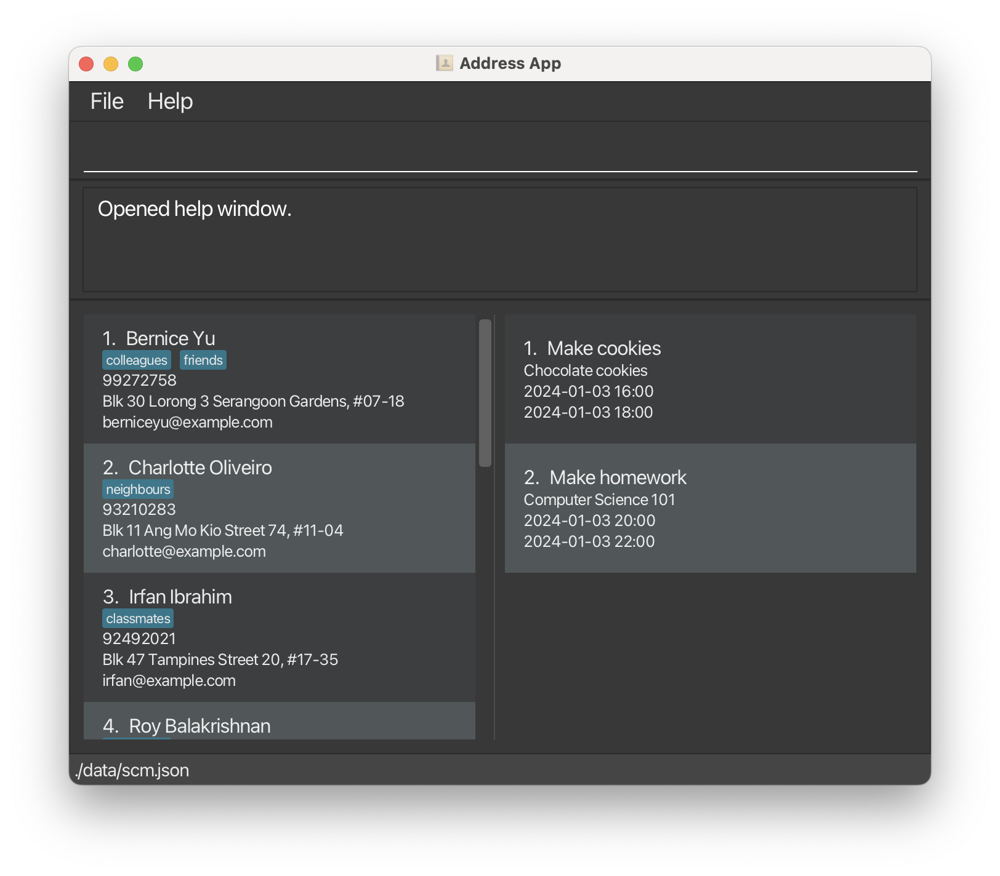
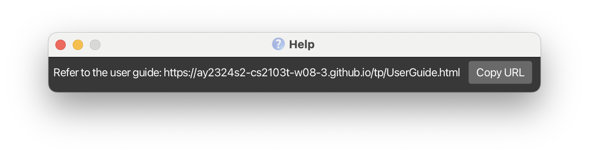
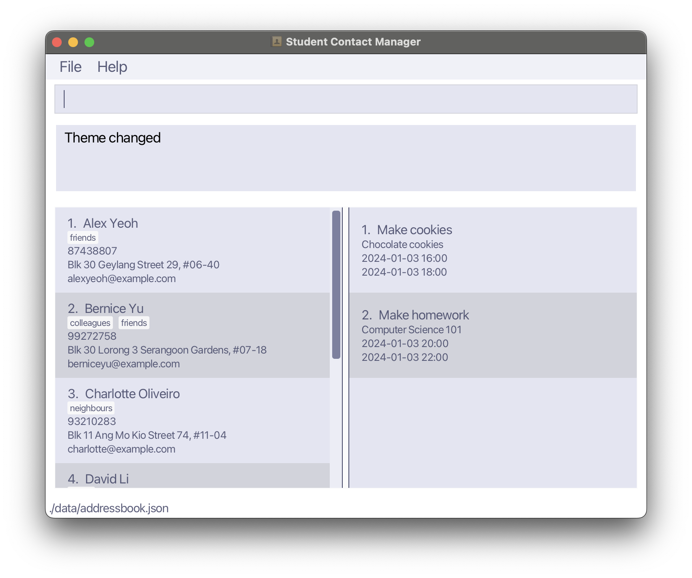
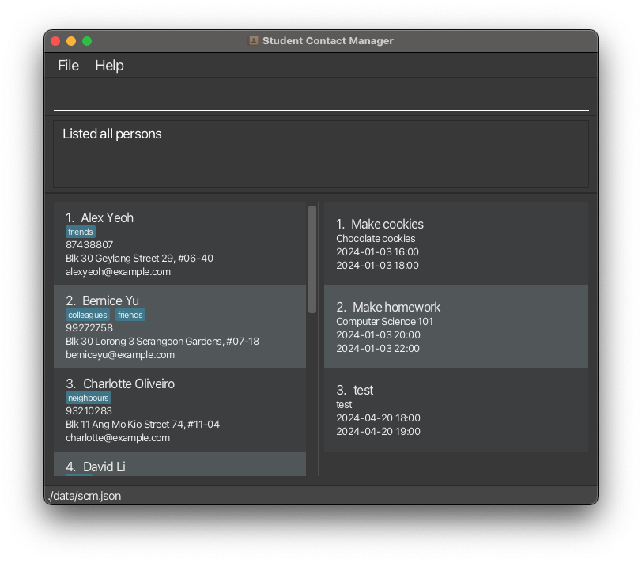
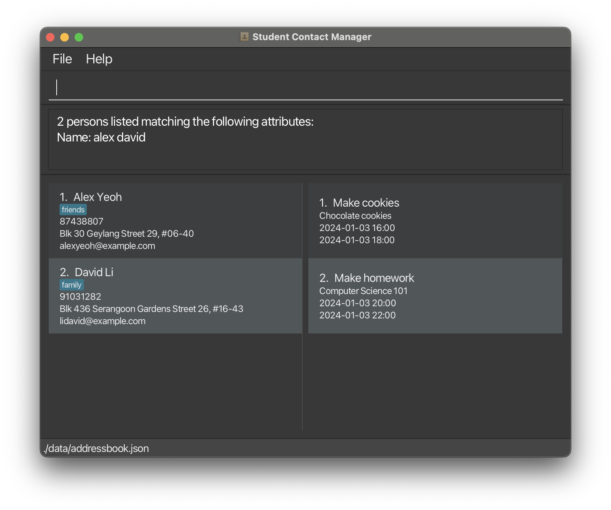
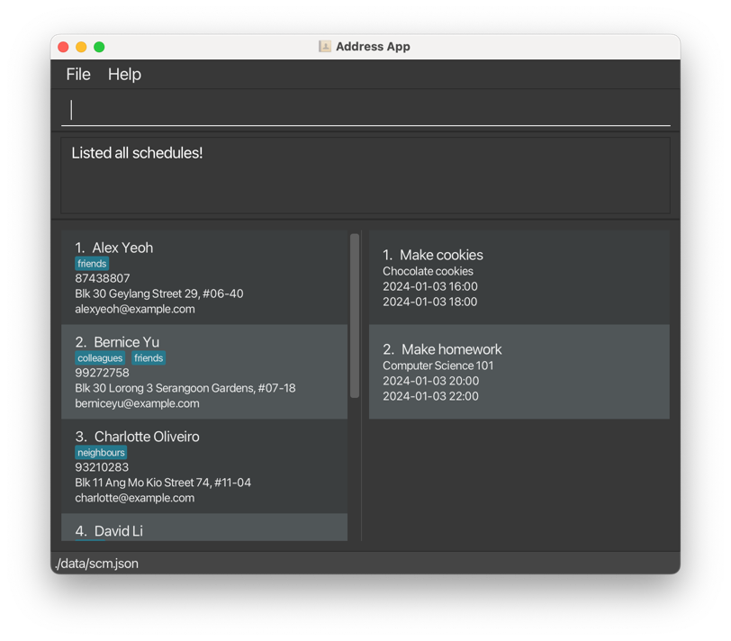

# Student Contact Manager User Guide

Hi there! Welcome to our user guide for Student Contact Manager, a student-designed application made for busy university students who are in need of managing their daily activities. It contains many features that help with the management of contacts and events, such as adding, deleting, editing, viewing, and finding of contacts, as well as adding, deleting, editing, viewing, and listing ongoing events. The application also helps with importing and exporting of contacts for better portability.

This user guide aims to aid you in your usage of our application, as well as to explore its various features that can help you manage your own daily activities. To navigate the application, you can use the table of contents placed below. There are also links posted throughout the application that lead back to the table of contents to ease navigability.

<!-- * Table of Contents -->
<page-nav-print />

--------------------------------------------------------------------------------------------------------------------

## Quick start

1. Ensure you have Java `11` or above installed in your computer.
    * To check whether you have the above installed, open the terminal on your device, and then run `java -version`.

2. Download the latest `scm.jar` from [here](https://github.com/AY2324S2-CS2103T-W08-3/tp/releases).

3. Copy the file to the folder you want to use as the _home folder_ for Student Contact Manager.

4. Open a command terminal, change the directory (`cd`) into the folder you put the `.jar` file in, and use the `java -jar scm.jar` command to run the application. 
   A GUI similar to the below should appear in a few seconds. Note how the app contains some sample data. 
   

5. Type the command you want to run inside the command box and press `Enter` to execute it. As an example, typing `help` and pressing `Enter` will open the help window. 
   There are some example commands you can try:

   * `list` : Lists all contacts.

   * `add n/John Doe p/98765432 e/johnd@example.com a/John street, block 123, #01-01` : Adds a contact named `John Doe` to the Student Contact Manager.

   * `delete 3` : Deletes the 3rd contact shown in the current list.

   * `clear` : Deletes all contacts.

   * `exit` : Exits the app.

6. Refer to the [Features](#features) section below for the complete list of commands as of each command.

--------------------------------------------------------------------------------------------------------------------

## Features

<box type="info" seamless>

**Notes about the command format and application:** 

* Words in `UPPER_CASE` are the parameters to be supplied by the user. 
  e.g. in `add n/NAME`, `NAME` is a parameter which can be used as `add n/John Doe`.

* Items in square brackets are optional. 
  e.g `n/NAME [t/TAG]` can be used as `n/John Doe t/friend` or as `n/John Doe`.
  * **Note**: Sometimes, commands require the presence of at least one optional item. This will be made clear in the description of each individual command.

* Items with `...` after them can be used multiple times, including zero times. 
  e.g. `[t/TAG] ...` can be used as ` ` (i.e., 0 times), `t/friend`, `t/friend t/family`, etc.

* Parameters can be in any order. 
  e.g. if the command specifies `n/NAME p/PHONE_NUMBER`, `p/PHONE_NUMBER n/NAME` is also acceptable.

* Extraneous parameters for commands that do not take in parameters (such as `help`, `list`, `exit` and `clear`) will be ignored. 
  e.g. if the command specifies `help 123`, it will be interpreted as `help`.

* If you are using a PDF version of this document, be careful when copying and pasting commands that span multiple lines as space characters surrounding line-breaks may be omitted when copied over to the application.

* The application is only able to work properly using ASCII characters (i.e., standard characters found on an English keyboard). The use of other character sets is currently unsupported.

* All commands are case-sensitive. As an example, listing contacts requires the `list` command (with all lowercase characters). Variants such as `LIST` or `List` will not be accepted by the application.

</box>

Click [here](#student-contact-manager-user-guide) to go back to the top of this user guide.

### Viewing help : `help`

Shows a message explaining how to access the help page. The help page is located at <https://ay2324s2-cs2103t-w08-3.github.io/tp/UserGuide.html>.

Format: `help`

Click [here](#student-contact-manager-user-guide) to go back to the top of this user guide.

### Changing the theme : `theme`

Changes the theme of the application. Useful if you wish to change the appearance of the application. The application currently supports `light` and `dark` themes. 

Below is a picture of how the light theme is supposed to look like:

Format: `theme THEME_NAME`

Examples:
* `theme light`
* `theme dark`

Click [here](#student-contact-manager-user-guide) to go back to the top of this user guide.

### Adding a person: `add`

Adds a person to the Student Contact Manager. Useful if you need to store a person's details for recording purposes. There are various details that must be added, including name, phone number, email, and address. Tags are optional. The name must be alphanumeric (i.e., no punctuations are allowed) and can contain spaces after the first character.

Format: `add n/NAME p/PHONE_NUMBER e/EMAIL a/ADDRESS [t/TAG] ...`

<box type="tip" seamless>

**Tip:** A person can have any number of tags (including 0)
</box>

Examples:
* `add n/John Doe p/98765432 e/johnd@example.com a/John street, block 123, #01-01`
* `add n/Betsy Crowe t/friend e/betsycrowe@example.com a/Newgate Prison p/1234567 t/criminal`

Click [here](#student-contact-manager-user-guide) to go back to the top of this user guide.

### Listing all persons : `list`

Shows a list of all persons in the contact manager. Useful if you need to view all contacts that you have recorded.

Format: `list`

Click [here](#student-contact-manager-user-guide) to go back to the top of this user guide.

### Editing a person : `edit`

Edits an existing person in the contact manager. Useful if you need to edit a person's details to be updated, or if you have inputted a wrong field. Existing values will be updated to the input values.

Format: `edit INDEX [n/NAME] [p/PHONE] [e/EMAIL] [a/ADDRESS] [t/TAG] ...`

<box type="info" seamless>

* Edits the person at the specified `INDEX`.
* The index refers to the index number shown in the displayed person list.
* The index **must be a positive integer**, such as 1, 2, 3, ...
* At least one of the optional fields must be provided. This means that either `NAME`, `PHONE`, `EMAIL`, `ADDRESS` or `TAG` needs to be provided.
* When editing tags, the existing tags of the person will be removed i.e., adding of tags is not cumulative.
* You can remove all the person’s tags by typing `t/` without
    specifying any tags after it.

</box>

Examples:
*  `edit 1 p/91234567 e/johndoe@example.com` Edits the phone number and email address of the 1st person to be `91234567` and `johndoe@example.com` respectively.
*  `edit 2 n/Betsy Crower t/` Edits the name of the 2nd person to be `Betsy Crower` and clears all existing tags. This is because the new tag list is empty.

Click [here](#student-contact-manager-user-guide) to go back to the top of this user guide.

### Locating persons by name: `find`

Finds persons whose names contain any of the given keywords. Useful if you need to find a certain contact's details without going through the entire list of contacts.

Format: `find [n/NAME] [a/ADDRESS] [t/TAG]`

<box type="info" seamless>

* `find` needs to have at least one of `n/NAME`, `a/ADDRESS`, or `t/TAG` to run.
* The search is case-insensitive. e.g., `hans` will match `Hans`
* The order of the keywords does not matter. e.g. `Hans Bo` will match `Bo Hans`
* Only full words will be matched e.g. `Han` will not match `Hans`
* Persons matching at least one keyword will be returned (i.e., it is an `OR` search).
  * e.g. `Hans Bo` will return `Hans Gruber`, `Bo Yang`
* If multiple attributes are given, then all given attributes must be matched for the contact to be returned.

</box>

Examples:
* `find n/John` returns `john` and `John Doe`
* `find n/alex david` returns `Alex Yeoh`, `David Li` 
  
* `find n/alex david t/friends` will only return `Alex Yeoh`.
* `find a/Serangoon` will return `Bernice Yu` and `David Li`.

Click [here](#student-contact-manager-user-guide) to go back to the top of this user guide.

### Exporting a subset of data: `find_and_export`
Exports the users that are filtered by a tag and other optional parameters. Useful if you want to transfer data regarding groups of people from one device to another. Filenames can only be alphanumeric with either `.csv` or `.json` extensions.

Format: `find_and_export TAG [n/NAME] [a/ADDRESS] [f/FILENAME]`

* `TAG` needs to be a tag.
* `NAME` needs to be a substring of a person's name.
* `ADDRESS` needs to be a substring of a person's address.
* `FILENAME` needs to be a valid filename, and can only have alphanumeric characters.

<box type="info" seamless>
* A substring is any part of a string.
* A string is any combination of characters.
</box>

Examples:
* `find_and_export cs2103t`
* `find_and_export cs2103t n/john a/olive street 42 f/output1.json`
* `find_and_export cs2103t n/john a/olive street 42 f/output1.csv`

Tip: `FILENAME` is optional. If provided, it has to be a valid filename with a `.json` or `.csv` extension.

Click [here](#student-contact-manager-user-guide) to go back to the top of this user guide.

### Importing a datafile: `import`

Imports contact details from a specified CSV or JSON file. Useful if you have many contacts that you wish to add in one go. Filenames can only be alphanumeric with either `.csv` or `.json` extensions.

Format: `import f/FILENAME_1 [f/FILENAME_2] [f/FILENAME_3] ...`

<box type="info" seamless>

* `FILENAME_n` needs to be a valid filename that is found in the `./data/` directory
* Persons that exist in any data file to be imported should not be duplicates of each other or of persons already existing inside the contact manager.

</box>

Examples:
* `import f/export.json`
* `import f/contactsExport.csv`
* `import f/contactsExport1.json f/contacts_export2.csv`

Click [here](#student-contact-manager-user-guide) to go back to the top of this user guide.

### Deleting a person : `delete`

Deletes the specified person from the contact manager. Useful if you wish to remove contacts that you no longer need.

Format: `delete INDEX`

* Deletes the person at the specified `INDEX`.
* The index refers to the index number shown in the displayed person list.
* The index **must be a positive integer** 1, 2, 3, ...
* The index must be not greater than the number of persons in the contact manager.

Examples:
* `list` followed by `delete 2` deletes the 2nd person in the contact manager.
* `find n/Betsy` followed by `delete 1` deletes the 1st person in the results of the `find` command.

Click [here](#student-contact-manager-user-guide) to go back to the top of this user guide.

### Clearing all entries : `clear`

Clears all contact entries from the contact manager. Useful to clean up contacts if all of them are no longer needed.

Format: `clear`

Click [here](#student-contact-manager-user-guide) to go back to the top of this user guide.

### Adding an event : `add_schedule`

Adds the schedule to the end of the list. Useful for recording details about events that occur. The schedule title and description must be alphanumeric and can contain spaces after the first character.

Format: `add_schedule title/TITLE d/DESCRIPTION start/START_DATETIME end/END_DATETIME`

<box type="info" seamless>

* Both `START_DATETIME` and `END_DATETIME` need to be in `YYYY-MM-DD HH:mm` format.
  * `YYYY` refers to the year (in 4-digit format).
  * `MM` refers to the month (in 2-digit format). As an example, March would be translated to `03`.
  * `DD` refers to the date (in 2-digit format).
  * `HH` refers to the hour (in 24-hour format).
  * `mm` refers to the minute.
  * As an example, 4PM on March 5th, 2024 would be entered in as `2024-03-05 16:00`.

</box>

Click [here](#student-contact-manager-user-guide) to go back to the top of this user guide.

### Editing an event : `edit_schedule`

Edits the schedule at the specified index. Useful if you wish to edit a certain schedule's description or timings.

Format: `edit_schedule INDEX [title/TITLE] [d/DESCRIPTION] [start/START_DATETIME] [end/END_DATETIME]`

<box type="info" seamless>

* `INDEX` has to be a positive number that is found as an index for the schedule.
* Either one of `TITLE`, `DESCRIPTION`, `START_DATETIME` or `END_DATETIME` has to be provided for the command to run.
* `TITLE` and `DESCRIPTION` must be alphanumeric
* `START_DATETIME` and `END_DATETIME` are in `YYYY-MM-DD HH:mm` format and must be valid datetimes.

</box>

Click [here](#student-contact-manager-user-guide) to go back to the top of this user guide.

### Listing all events : `list_schedule`

Lists all the events currently available. Useful if you wish to view all the events that are in the database.

Format: `list_schedule`

Click [here](#student-contact-manager-user-guide) to go back to the top of this user guide.

### Listing ongoing events : `list_ongoing_schedule`

Lists all the events that are currently ongoing. Useful if you wish to view all the events that are currently ongoing.

Format: `list_ongoing_schedule`

Click [here](#student-contact-manager-user-guide) to go back to the top of this user guide.

### Finding events : `find_schedule`

Finds all events that match the given attributes. Useful if you wish to find events that match certain criteria.

Format: `find_schedule [title/TITLE] [d/DESCRIPTION] [before/BEFORE_DATETIME] [after/AFTER_DATETIME] [during/DURING_DATETIME]`

<box type="info" seamless>

* `find_schedule` needs to have at least one of `TITLE`, `DESCRIPTION`, `BEFORE_DATETIME`, `AFTER_DATETIME` or `DURING_DATETIME` to run.
* For `TITLE` and `DESCRIPTION`:
    * The search is case-insensitive. e.g., `Meeting` will match `meeting`.
    * The order of the keywords does not matter. e.g. `Meeting Project` will match `Project Meeting`.
    * Only full words will be matched e.g. `Meet` will not match `Meeting`
    * Schedules matching at least one keyword will be matched for that attribute (i.e., it is an `OR` search).
        * e.g. `Meeting Project` will be matched by `Zoom Meeting`, `Coding Project`.
* For `BEFORE_DATETIME`, `AFTER_DATETIME` and `DURING_DATETIME`:
    * The datetime must be a valid datetime in `YYYY-MM-DD HH:mm` format.
    * Schedules matching all given datetime attributes will be returned (i.e., it is an `AND` search).
        * e.g. `before/2021-10-10 12:00 after/2021-10-10 10:00` will return schedules that are between `10:00` and `12:00` on `2021-10-10`.
    * The `BEFORE_DATETIME` attribute is matched if the schedule ends on or before the given datetime.
    * The `AFTER_DATETIME` attribute is matched if the schedule starts on or after the given datetime.
    * The `DURING_DATETIME` attribute is matched if the given datetime is between the start datetime and end datetime of the schedule, inclusive.
* If multiple attributes are given, then all given attributes must be matched for the event to be returned.

</box>

Click [here](#student-contact-manager-user-guide) to go back to the top of this user guide.

### Deleting an event : `delete_schedule`

Deletes the event at the given index. Useful if you wish to delete an event that is no longer needed.

Format: `delete_schedule INDEX`

<box type="info" seamless>

* `INDEX` must be a positive integer and not greater than the number of schedules in the displayed schedule list.

Click [here](#student-contact-manager-user-guide) to go back to the top of this user guide.

### Clearing all events : `clear_schedule`

Clears all events from the schedule list. Useful if you wish to clear all events that are no longer needed.

Format: `clear_schedule`

Click [here](#student-contact-manager-user-guide) to go back to the top of this user guide.

### Calendar view of schedule : `calendar_view`

Shows your schedule for the month in a pop-up window. Useful to see an overall view of schedules in the month.

Format: `calendar_view`

</box>

Click [here](#student-contact-manager-user-guide) to go back to the top of this user guide.

### Exiting the program : `exit`

Exits the program.

Format: `exit`

Click [here](#student-contact-manager-user-guide) to go back to the top of this user guide.

### Saving the data

Student Contact Manager data are saved in the hard disk automatically after any command that changes the data. There is no need to save manually.

Click [here](#student-contact-manager-user-guide) to go back to the top of this user guide.

### Editing the data file

Student Contact Manager data are saved automatically as a JSON file `[JAR file location]/data/addressbook.json`. Advanced users are welcome to update data directly by editing that data file.

<box type="warning" seamless>

**Caution:**
If your changes to the data file makes its format invalid, Student Contact Manager will discard all data and start with an empty data file at the next run.  Hence, it is recommended to take a backup of the file before editing it.  
Furthermore, certain edits can cause Student Contact Manager to behave in unexpected ways (e.g., if a value entered is outside the acceptable range). Therefore, edit the data file only if you are confident that you can update it correctly.

</box>

Click [here](#student-contact-manager-user-guide) to go back to the top of this user guide.

--------------------------------------------------------------------------------------------------------------------

## FAQ

**Q**: How do I transfer my data to another computer? 
**A**: Install the app in the other computer and overwrite the empty data file it creates with the file that contains the data of your previous Student Contact Manager home folder.

Click [here](#student-contact-manager-user-guide) to go back to the top of this user guide.

--------------------------------------------------------------------------------------------------------------------

## Known issues

1. **When using multiple screens**, if you move the application to a secondary screen, and later switch to using only the primary screen, the GUI will open off-screen. The remedy is to delete the `preferences.json` file created by the application before running the application again.

Click [here](#student-contact-manager-user-guide) to go back to the top of this user guide.

--------------------------------------------------------------------------------------------------------------------

## Command summary

| Action                      | Format, Examples                                                                                                                                                                     |
|-----------------------------|--------------------------------------------------------------------------------------------------------------------------------------------------------------------------------------|
| **Add Person**              | `add n/NAME p/PHONE_NUMBER e/EMAIL a/ADDRESS [t/TAG]...`   e.g., `add n/James Ho p/22224444 e/jamesho@example.com a/123, Clementi Rd, 1234665 t/friend t/colleague`               |
| **Clear Persons**           | `clear`                                                                                                                                                                              |
| **Delete Person**           | `delete INDEX`  e.g., `delete 3`                                                                                                                                                  |
| **Edit Person**             | `edit INDEX [n/NAME] [p/PHONE_NUMBER] [e/EMAIL] [a/ADDRESS] [t/TAG] ...`  e.g.,`edit 2 n/James Lee e/jameslee@example.com`                                                        |
| **Find Persons**            | `find [n/NAME] [a/ADDRESS] [t/TAG]`   e.g., `find n/James Jake`                                                                                                                   |
| **List Persons**            | `list`                                                                                                                                                                               |
| **Help**                    | `help`                                                                                                                                                                               |
| **Find and Export to File** | `find_and_export TAG [n/NAME] [a/ADDRESS] [f/FILENAME]`   e.g., `find_and_export friends`                                                                                         |
| **Import from File**        | `import f/FILENAME_1 [f/FILENAME_2] [f/FILENAME_3] ...`   e.g., `import f/export_file.json`                                                                                       |
| **Add Schedule**            | `add_schedule title/TITLE d/DESCRIPTION start/START_DATETIME end/END_DATETIME`   e.g., `add_schedule title/Meeting d/Project Meeting start/2024-03-10 16:00 end/2024-03-10 18:00` |
| **Clear Schedules**         | `clear_schedule`                                                                                                                                                                     |
| **Delete Schedule**         | `delete_schedule INDEX`   e.g., `delete_schedule 1`                                                                                                                               |
| **Edit Schedule**           | `edit_schedule INDEX [title/TITLE] [d/DESCRIPTION] [start/START_DATETIME] [end/END_DATETIME]`   e.g., `edit_schedule 1 title/Project meeting`                                     |
| **Find Schedules**          | `find_schedule [title/TITLE] [d/DESCRIPTION] [before/BEFORE_DATETIME] [after/AFTER_DATETIME] [during/DURING_DATETIME]`   e.g., `find_schedule title/Meeting`                      |
| **List Schedules**          | `list_schedule`                                                                                                                                                                      |
| **List Ongoing Schedule**   | `list_ongoing_schedule`                                                                                                                                                              |
| **Calendar View**           | `calendar_view`                                                                                                                                                                      |
Click [here](#student-contact-manager-user-guide) to go back to the top of this user guide.
